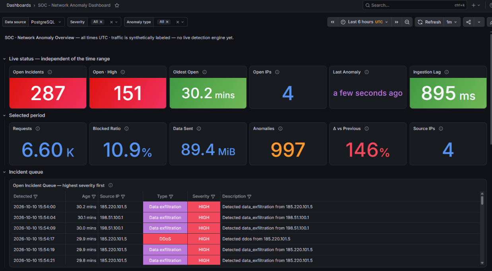
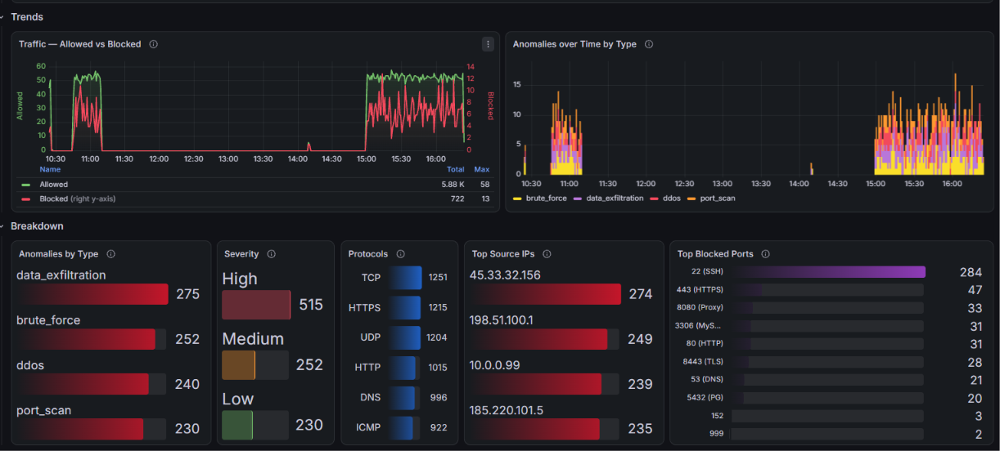
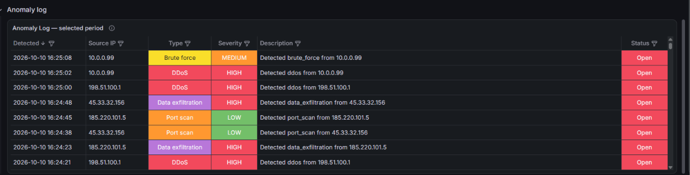
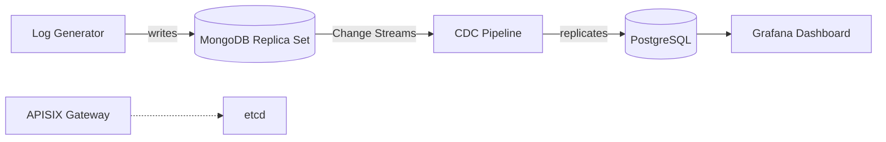

# Network Anomaly Detection Platform

[](https://github.com/nourchtourouu-arch/network-anomaly-platform/actions/workflows/ci.yml)
[](LICENSE)
[](docker-compose.yml)

A containerized Security Operations Center (SOC) reference platform for real-time network traffic ingestion, rule-based anomaly detection, and operational monitoring. The system demonstrates a Change Data Capture (CDC) pipeline from a document store to a relational analytical store, fronted by a live monitoring dashboard and protected by a WAF gateway.

**Status:** Portfolio / demonstration project. Not intended for production deployment without the hardening steps described in [Security Considerations](#7-security-considerations).

---


*Live status row (independent of the selected time range) and the open incident queue, highest severity first.*


*Allowed vs. blocked traffic over time, anomaly volume by type, and breakdowns by severity, protocol, source IP, and blocked port.*


*Full anomaly log for the selected time range, filterable by severity and type.*

---

## 1. System Overview

The platform ingests simulated network traffic, replicates it through a CDC pipeline into an analytical database, and exposes the resulting dataset through a monitoring dashboard. A reverse proxy / WAF component demonstrates request-level traffic filtering independent of the data pipeline.

### 1.1 Architecture



### 1.2 Component Responsibilities

| Component | Responsibility |
|---|---|
| Log Generator | Produces synthetic network traffic records (normal and anomalous) and writes them to MongoDB. |
| MongoDB (Replica Set) | Primary ingestion store. Replica set mode is required to expose Change Streams. |
| CDC Pipeline | Subscribes to MongoDB Change Streams and replicates each inserted document into PostgreSQL, with retry and exponential backoff on connection loss. |
| PostgreSQL | Analytical store queried by the dashboard. Indexed for time-range and status-filter access patterns. |
| Grafana | Visualization layer. Connects to PostgreSQL through a dedicated read-only role. |
| APISIX + etcd | Gateway layer demonstrating rate limiting, IP-based blocking, and request filtering. Operates independently of the data pipeline described above. |

---

## 2. Technology Stack

| Layer | Technology | Version |
|---|---|---|
| Data generation | Python, PyMongo | 3.12 / 4.7.2 |
| Ingestion store | MongoDB (Replica Set) | 7.x |
| CDC pipeline | Python, psycopg2 | 3.12 / 2.9.9 |
| Analytical store | PostgreSQL | 16.x |
| Visualization | Grafana | latest |
| Gateway / WAF | Apache APISIX | 3.9.0 |
| Configuration store | etcd | 3.5.0 |
| Orchestration | Docker Compose | — |

---

## 3. Prerequisites

- Docker Engine and Docker Compose v2
- Minimum 2 GB of available RAM
- Ports `3000`, `5432`, `9080`, `9092`, `9443`, `27017`, `2379` available on the host

---

## 4. Deployment Procedure

### 4.1 Configuration

Clone the repository and create the environment file from the provided template:

```bash
git clone https://github.com/<your-username>/network-anomaly-platform.git
cd network-anomaly-platform
cp .env.example .env
```

Edit `.env` and set values for all required variables:

| Variable | Purpose |
|---|---|
| `POSTGRES_DB` | Database name |
| `POSTGRES_USER` | Application (read-write) database user |
| `POSTGRES_PASSWORD` | Password for the application user |
| `GRAFANA_ADMIN_PASSWORD` | Grafana administrator password |
| `GRAFANA_RO_PASSWORD` | Password assigned to the read-only `grafana_ro` role |
| `APISIX_ADMIN_KEY` | Admin API key for the APISIX gateway. Must be rotated from the default before exposing the admin API beyond localhost. |
| `SLACK_WEBHOOK_URL` | Optional. Incoming webhook URL for Slack alerting on high-severity anomalies (see [§5](#5-dashboard-design-notes)). Leave empty to disable — the pipeline runs normally either way. |

No credentials are stored in source control. `.env` is excluded via `.gitignore`.

### 4.2 Startup

```bash
docker compose up --build
```

This provisions all services, initializes the MongoDB replica set, applies the PostgreSQL schema (`sql/init.sql`), and auto-provisions the Grafana datasource and dashboard.

### 4.3 Post-Deployment Hardening

Create the read-only PostgreSQL role used by Grafana, and apply the indexes the dashboard depends on:

```bash
docker exec -i postgres psql -U "$POSTGRES_USER" -d "$POSTGRES_DB" \
  -v grafana_ro_password="$GRAFANA_RO_PASSWORD" < sql/db-setup.sql
docker restart grafana
```

This step is idempotent and safe to re-run.

### 4.4 Service Endpoints

| Service | Endpoint | Authentication |
|---|---|---|
| Grafana dashboard | `http://localhost:3000` | `admin` / `GRAFANA_ADMIN_PASSWORD` |
| APISIX gateway | `http://localhost:9080` | — |
| PostgreSQL | `localhost:5432` | Values from `.env` |
| MongoDB | `localhost:27017` | — |

---

## 5. Dashboard Design Notes

The Grafana dashboard is built to be time-range-correct and filterable, not a static snapshot:

- `$severity`, `$anomaly_type`, and `$datasource` are live template variables bound into every panel query, not decorative filters.
- All time-series panels use the `$__timeFilter` / `$__timeGroup` macros so the dashboard time picker behaves correctly.
- A dedicated **Live Status** row (open incident count, backlog age, ingestion lag) is intentionally independent of the selected time range, since operational status should not be hidden by a narrow window selection.
- Grafana connects through the least-privilege `grafana_ro` role rather than the pipeline's read-write user.

In addition to the dashboard, the CDC pipeline itself pushes a throttled Slack alert (one per 10-second window, at most) whenever it commits a high-severity anomaly — configured via the optional `SLACK_WEBHOOK_URL` variable. This is independent of Grafana's own alerting, which is not yet configured (see [Roadmap](#8-roadmap)).

---

## 6. Repository Structure

```
network-anomaly-platform/
├── .github/
│   └── workflows/
│       └── ci.yml           Lint, config validation, image build
├── generator/                Traffic simulation service
│   ├── log_generator.py
│   ├── requirements.txt
│   └── Dockerfile
├── cdc/                      CDC replication service (+ Slack alerting)
│   ├── cdc_pipeline.py
│   ├── requirements.txt
│   └── Dockerfile
├── sql/
│   ├── init.sql              Schema definition
│   └── db-setup.sql          Read-only role and index provisioning
├── grafana/
│   └── provisioning/
│       ├── datasources/      Auto-provisioned PostgreSQL connection
│       └── dashboards/       Auto-provisioned dashboard definition
├── waf/                      APISIX route and plugin configuration
├── docker-compose.yml
├── .env.example
├── LICENSE
└── README.md
```

---

## 7. Security Considerations

This project is a demonstration of the described patterns and is not hardened for production use as-is. Known limitations:

- The APISIX admin API key shipped in `waf/config.yaml` is the publicly documented default value and must be rotated before the admin API is exposed beyond localhost.
- `source_ip` fields in generated traffic are synthetic. In a real deployment behind a load balancer or reverse proxy, IP attribution requires explicit `X-Forwarded-For` handling and a trusted proxy allowlist.
- Anomaly classification is rule-based (static thresholds and patterns), not model-driven. See [Roadmap](#8-roadmap).
- TLS is not configured between internal services; all inter-service traffic is unencrypted, which is acceptable for local demonstration only.
- `waf/apisix.yaml` defines the intended WAF routes (rate limiting, IP blocklist, path-based filtering) as declarative reference configuration. In the current deployment, APISIX runs in `traditional` mode with etcd as the config store, so this file is not read at runtime — the routes must be provisioned into etcd through the Admin API before the gateway actually enforces them. See [Roadmap](#8-roadmap).

---

## 8. Roadmap

- Replace rule-based detection with a trained anomaly-scoring model
- Provision `waf/apisix.yaml`'s routes into etcd via the APISIX Admin API so the WAF actively enforces rate limiting and IP blocking
- Add Grafana Alerting rules with Slack/email notification channels (complementary to the CDC pipeline's own Slack alerting, described in [§5](#5-dashboard-design-notes))
- Extend the CI pipeline with automated integration tests against a running stack
- Add a cloud deployment variant using managed MongoDB and PostgreSQL
- Integrate an external threat intelligence feed (e.g., AbuseIPDB)
- Add simulated incident resolution so long-running demos reflect closed incidents

---

## 9. License

Released under the [MIT License](LICENSE).

---

## 10. Author

**Nour Chtourou** — M.Sc. Cloud & Network Engineering

[GitHub](https://github.com/nourchtourouu-arch) · [LinkedIn](#)
